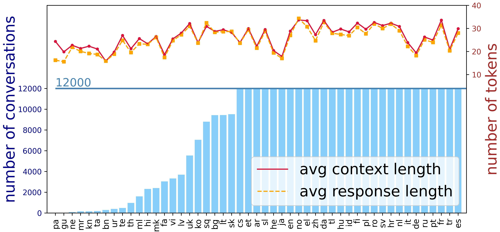

#  MDIA: A Benchmark for Multilingual Dialogue Generation in 49 Languages

You can get our paper on []

## Introduction

MDIA is the first large-scale multilingual benchmark for dialogue generation. It covers real-life conversations in 49 languages across 19 language families. We present baseline results obtained by fine-tuning the multilingual, non-dialogue-focused pre-trained model mT5 as well as English-centric, dialogue-focused pre-trained chatbot DialoGPT. 

In addition, we also publish this MdiaTool to help researchers to get more dialogue data by themselves easily.

# How to use our MdiaTool

We split the process of fetching data into two steps:

1. Zip: Compress the original reddit comment data (extract some tags) and identify the language, and then store it in the detaileddata folder
2. Generate: Using reddit API to obtain parent comments, identify languages and build dialogue

Next, we will introduce in detail how to complete the entire data acquisition process.

### 1. Installation

1. First, you need to install the corresponding pytorch package according to the CUDA version.
2. Install dependent packages

```bash
$ pip install -r requirements.txt
```
Python 3.8+ is recommended.

### 2. Prepare the raw data

from  [this website](https://files.pushshift.io/reddit/comments/) download the data and put it in the ./data/RawData folder(you need to create it by yourself), and then unzip it.

### 3. Zip

cd ./crawl and then run the command below:
   ```python
   python main.py zip RC_2020-02
   ```
   Replace `RC_2020-02` with file you need to zip

### 4. Generate

After you complete the step `zip`，cd ./crawl and then run the command below
   ```python
   python main.py generate RC_2020-02
   ```
Replace `RC_2020-02` with file name you need to generate conversations


# The Datasets we used

If you don't need to construct your own dataset, we provide the dataset we used in our paper. 

As shown below is the statistic of small MDIA.



It should be emphasized that the dataset we finally obtained is not only the above-mentioned scale, and we will release the full version after finishing the compilation.

## What can dataset do

1. Train: Use the collected corpus to fine tune the model to the dialogue generation task
2. Eval: Evaluate the generation effect of the model in various languages

### Train

cd ./train_val and then run the command below:
```python
   python main.py --do train --lang ko
```

### Evaluate

cd ./train_val and then run the command below:
```python
   python main.py  --model_name microsoft/DialoGPT-large --do evaluate --lang ko
```

The training and evaluate script accept several arguments to tweak the training:

| Argument   | Type | Default value   | Description                                       |
| ---------- | ---- | --------------- | ------------------------------------------------- |
| model_name | str  | google/mt5-base | which model to train or evaluate                  |
| do         | str  | train           | to train or to eval                               |
| lang       | str  |                 | which language to train or evaluate               |
| translated | bool | False           | whether to use MarianMT                           |
| raw        | bool | False           | whether to use zero-shot DialoGPT                 |
| small      | int  | 10000           | desice how many data to used to train or evaluate |
| gpu        | str  | 0               | which gpu to use                                  |

# Citation